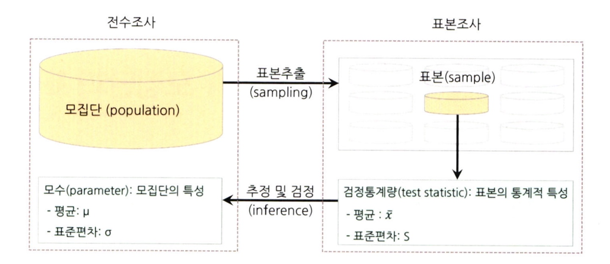
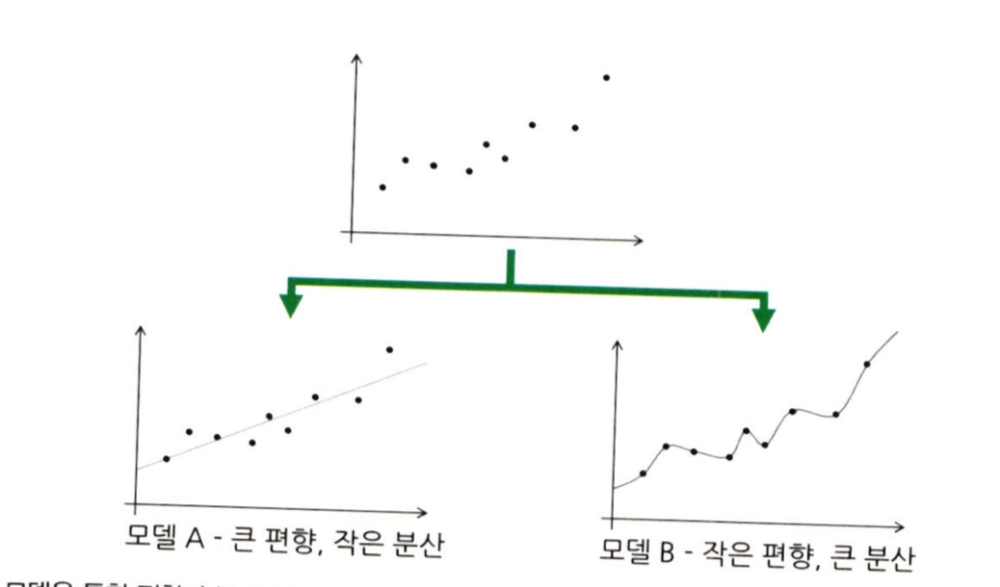
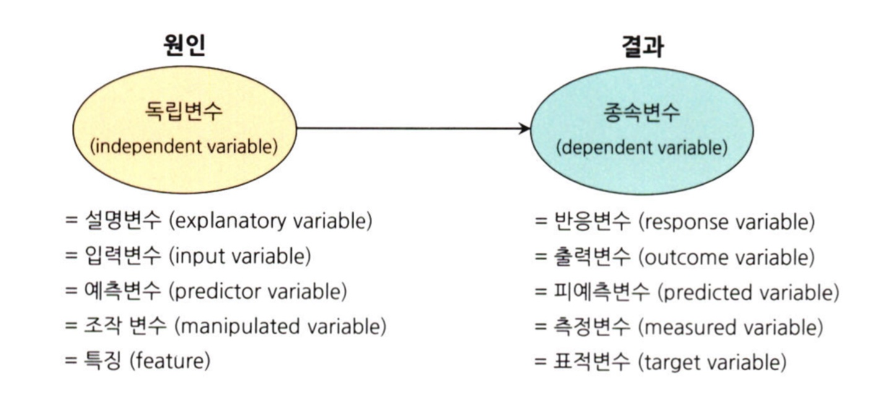
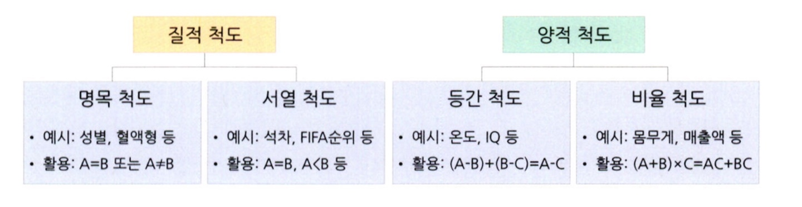

# 통계학 1주차 정규과제

📌통계학 정규과제는 매주 정해진 분량의 『*데이터 분석가가 반드시 알아야 할 모든 것*』 을 읽고 학습하는 것입니다. 이번 주는 아래의 **Statistics_1st_TIL**에 나열된 분량을 읽고 `학습 목표`에 맞게 공부하시면 됩니다.

아래의 문제를 풀어보며 학습 내용을 점검하세요. 문제를 해결하는 과정에서 개념을 스스로 정리하고, 필요한 경우 추가자료와 교재를 다시 참고하여 보완하는 것이 좋습니다.

1주차는 `1부. 데이터 기초체력 기르기`를 읽고 새롭게 배운 내용을 정리해주시면 됩니다.


## Statistics_1st_TIL

### 1부. 데이터 기초체력 기르기
### 01. 통계학 이해하기
### 02. 모집단과 표본추출
### 03. 변수와 척도
### 04. 데이터의 기술 통계적 측정
### 05. 확률과 확률변수

## Study Schedule

|주차 | 공부 범위     | 완료 여부 |
|----|----------------|----------|
|1주차| 1부 p.2~56     | ✅      |
|2주차| 1부 p.57~79    | 🍽️      | 
|3주차| 2부 p.82~120   | 🍽️      | 
|4주차| 2부 p.121~202  | 🍽️      | 
|5주차| 2부 p.203~254  | 🍽️      | 
|6주차| 3부 p.300~356  | 🍽️      | 
|7주차| 3부 p.357~615  | 🍽️      | 

<!-- 여기까진 그대로 둬 주세요-->

# 01. 통계학 이해하기

```
✅ 학습 목표 :
* 통계학의 필요성에 대해 인식한다.
* 기술통계와 추론통계의 특성을 구분할 수 있다.
```
**통계학의 필요성**
- 데이터 과학을 수행함에 있어서 통계학은 없어서는 안 될 기본 소양이다. 데이터 과학은 기초 통계로부터 발전해 왔으므로 그 의미 해석도 통계학에 기반한다. 통계학을 알고 분석을 해야 분석 결과의 의미, 오류, 개선 여부 등을 알 수 있기 때문이다. 

- 같은 데이터를 보더라도 통계학을 아는 사람이 더 나은 인사이트를 가질 수 있다. 

1. 데이터 수집
2. 데이터 가공
3. 탐색적 데이터 분석 / 데이터 시각화
4. M/L 모델링
5. 결과 해석 및 적용

위 순서로 데이터 과학 프로세스를 적용하며 그 과정에서 데이터의 분포, 연관성, 확률 등을 분석하고 가설을 설정하고 통꼐 분석으로 검증, 효과적인 머신러닝 모델을 기획할 수 있다.

**기술 통계와 추론 통계**
1. 기술 통계
- 기술 통계는 문자 그대로 주어진 데이터의 특성을 사실에 근거하여 설명하고 묘사하는 것

- ex) 30명의 A학급 학생들의 키를 평균이라는 대푯값으로 설명하여 파악

- 이처럼 전체 데이터를 평균, 중앙값, 최빈값 등의 대푯값으로 쉽고 직관적으로 파악할 수 있도록 설명

- 데이터의 분포도, 최댓값과 최솟값의 범위 등 다양한 방법으로 기술 통계를 내는 것을 EDA(Explanatory Data Analysis)라고함

- 단순한 수치보다는 그림이나 그래프를 통한 표현이 훨씬 효과적이기 때문에 시각화를 많이 사용

2. 추론 통계
- 추론 통계는 표본 집단으로부터 모집단의 특성을 추론하는 것이 목적

- ex) A학급 학생들의 평균 키를 살펴본 예시 -> 한 학급의 통계치를 통해 전체 학생의 통계치를 추정

- 'A학급의 평균 키가 170cm -> 전체 학생 평균은 167~173cm 내에 있을 것이다'

- 표본으로 구한 통곗값을 통해 모수의 값이나 모수 값이 특정 구간 내에 존재할 확률을 추정

- 머신러닝 모델을 만들고 예측하는 것이 추론 통계이며 이를 위해서 데이터의 편향이나 분산, 확률 분포, 가설 검정과 유의도 등 많은 개념이 필요


# 02. 모집단과 표본추출

```
✅ 학습 목표 :
* 모집단과 표본의 정의와 관계를 설명할 수 있다.
* 편향과 분산의 차이를 설명할 수 있다.
```

**모집단과 표본**
1. 모집단 (population)

- 통계 분석에서 분석 대상 전체의 집합

2. 표본 (sample)

- 모집단의 부분집합, 즉 일부를 추출한 것

3. 조사

- 전수조사: 모집단의 자료 전체를 조사 및 분석하여 정보 추출 ex) 선거 투표

- 표본조사: 모집단에서 추출한 표본을 통해 몾비단의 정보를 추정하고 검정 ex) 선거 전의 여론 조사



**편향과 분산**
1. 편향
- 비표본 오차의 원인이며 표본에서 나타는 모집단과의 체계적인 차이

- 표본추출편향, 가구편향, 무응답편향, 응답편향 등이 표본추출과정에서 발생 가능

- 확증 편향, 기준점 편향, 선택지원 편향, 분모 편향, 생존자 편향 등의 인지적 편향도 존재


- 편향과 분산은 트레이드오프 관계

- 데이터에 잘 맞도록 모델을 만들수록 편향은 줄어들고 분산은 증가

- A모델에서 예측값과 정답의 차이가 크게 나는 것이 편향, 반면 일반화가 잘 되어 있는 모델이므로 예측값의 변동성이 적고, 즉 분산이 작음

-B모델에서 예측값과 정답이 일치하므로 편향이 매우 작음, 반면 예측값의 위치가 제각각이라 다른 정답 값이 나오면 차이가 커질 수 있어 분산이 큼


# 03. 변수와 척도
```
✅ 학습 목표 :
* 독립변수, 종속변수의 관계를 파악할 수 있다.
* 척도(변수의 데이터적 속성)의 종류를 설명할 수 있다.
```
**독립변수와 종속변수**

- 독립변수와 종속변수는 원인과 결과의 관계

  ex) 흡연 -> 원인 -> 독립변수 / 
      폐암 -> 결과 -> 종속변수

- 독립변수와 종속변수는 수치끼리 상관관계를 가짐

-독립변수끼리도 상관관계를 가지는 경우가 있는데, 이 상관관계가 높으면 종속변수와의 연관성을 측정하기 어려워 이를 최소화 해야함



**척도의 종류**

1. 질적 (범주형) 척도
- 명목척도: 조사대상의 속성이나 범주를 구분하기 위한 목적
  
  순서, 거리, 원점의 개념이 없고 변수 간의 사칙연산도 의미 없음

- 서열척도: 조사대상의 속성 크기를 측정해 대상 간의 순서 관계를 측정

  순서와 우위에 대한 정보 포함, 하지만 순서 간의 간격에 대한 정보는 없음

2. 양적 (연속형) 척도
- 등간척도: 서열척도의 정보와 함께 속성의 상대적 크기의 차이를 비교

  속성 간의 상대적 차이를 가감할 수는 있지만 절대 0점은 정의할 수 없어 곱하기나 나누기는 불가능

- 비율척도: 가장 많은 정보를 담으며 순서, 상대적 크기, 절대적 기준을 통한 비율에 대한 정보 모두를 가짐

  절대 기준 0점이 존재하기 때문에 사칙연산 모두가 가능




# 04. 데이터의 기술 통계적 측정

```
✅ 학습 목표 :
* 산포도의 의미를 설명하고 측정방법을 나열할 수 있다.
* 정규분포의 왜도값과 첨도값이 얼마인지 답할 수 있다.
```

**산포도**

- 산포도는 분산도라고도 불리며 대푯값을 중심으로 자료들이 흩어져 있는 정도를 의미

- 분산과 표준편차를 포괄하는 상위 개념

- 측정 방법: 

         범위 - 최댓값에서 최솟값을 뺀 값

         분산 - 산술평균과 각 데이터의 편차를 제곱한 것의 평균

        표준편차 - 분산의 제곱근

        사분위수 범위: 전체 범위를 4개로 나누어 그 순서에 따른 위치값

        변동계수: 표준편차를 산술평균으로 나눈 값


**왜도와 첨도**

  - 왜도: 데이터 분포의 좌우 비대칭도를 표현하는 척도
         
          평균과 중앙값의 크기에 따라 오른꼬리 분포 / 왼꼬리 분포로 나뉨

          피어슨의 비대칭계수로 측정 가능

          정규분포에서는 평균값, 중앙값, 최빈값이 일치하기 때문에 피어슨 비대칭계수로 측정하면 0이 나옴

- 첨도: 분포가 정규분포보다 얼마나 뾰족하거나 완만한지 나타내는 척도

       데이터가 중심에 몰리면 뾰족한 모양, 퍼지면 구릉 모양

       중심에 얼마나 쏠려 있는가를 나타냄

       기본적으로는 3이 기준값이지만 편의상 0을 기준 값으로도 사용하며 이 값보다 크면 양의 첨도 / 급첨, 작으면 음의 첨도 / 완첨

       정규분포의 첨도 기준이 0일때 첨도가 음수로 작을수록 분포가 넓게 퍼지고 양수로 클수록 더 뾰족한 분포포
       


# 05. 확률과 확률변수

```
✅ 학습 목표 :
* 확률변수의 개념과 종류를 설명할 수 있다.
* 심슨의 역설을 설명하고, 발생 원인을 식별하며, 이를 해결하기 위한 방안을 도출할 수 있다.
```
**확률**

- 일정한 조건 안에서 특정 사건이 일어날 수 있는 가능성의 정도

- 수치는 0과 1 사이로 표시

- n번의 시행 중 사건 A가 일어날 확률 P(A) = x/n

- 확률의 종류:

        비조건확률: 아무런 조건이 없는 상황에서 사건이 일어날 확률 (한계확률) / P(A), P(B)로 표현

        결합확률: 표본공간 안에서 일어나는 사건 각각의 조합으로 이루어지는 확률 / 두 개 이상의 사건이 동시에 일어나는 확률 / 사건의 교집합

        조건부확률: 하나의 사건이 발생했다는 조건에서 다른 사건이 발생할 확률 / 동시에 발생하는 결합확률을 첫 번째 조건의 한계확률로 나누어 계산 / P(BㅣA)로 표현


<br>
<br>

# 확인 문제

## 문제 1.

> **🧚Q. 한 대형 병원이 두 명의 외과 의사(A와 B)의 수술 성공률을 비교하려고 한다. 과거 1년간의 데이터를 보면, A 의사의 전체 수술 성공률은 80%, B 의사의 전체 수술 성공률은 90%였다. 이 데이터를 본 병원 경영진은 A 의사의 실력이 B 의사보다 별로라고 판단하여 A 의사의 수술 기회를 줄이는 방향으로 정책을 조정하려 한다.
그러나 일부 의료진은 이 결론에 의문을 제기했다.
그들은 "단순한 전체 성공률이 아니라 더 세부적인 데이터를 분석해야 한다"고 주장했다.**

> **-A 의사의 실력이 실제로 B 의사보다 별로라고 결론짓는 것이 타당한가?   
-그렇지 않다면, 추가로 확인해야 할 정보는 무엇인가?**

<!--심슨의 역설을 이해하였는지 확인하기 위한 문제입니다-->

<!--학습한 개념을 활용하여 자유롭게 설명해 보세요. 구체적인 예시를 들어 설명하면 더욱 좋습니다.-->

```
심슨의 역설: 하위 그룹을 고려하지 않고 단순히 전체 데이터를 비교했을 때는 한 그룹이 더 우수해 보이지만 세부적으로 그룹을 나누어 분석하면 반대의 결론이 나올 수 있는 통계적 현상

병원 경영진은 의사의 실력 수술 성공률에 영향을 준다고 가정하고 단순히 성공률(80% vs. 90%)만 비교하고 있음

그러나 실제로 수술 성공률에 영향을 미치는 독립변수들이 있을 수 있으며 이 독립변수들이 서로 상관관계를 가질 가능성이 큼 

수술의 난이도, 환자의 상태, 수술 건수 등 여러 변수를 고려하지 않았기 때문에  의사가 B 의사보다 실력이 낮다고 결론짓기에는 타당하지 않다.

ex) 수술 난이도와 성공률의 관계
수술 성공률은 단순히 의사의 실력뿐만 아니라 수술 난이도에도 영향을 받음음

만약 A 의사가 어려운 수술을 더 많이 맡고 B 의사가 더더 쉬운 수술을 많이 맡았다면 의사의 실력과 수술 난이도가 서로 연관된 독립변수가 됨됨

 -> 수술 성공률이라는 종속변수는 의사의 실력뿐만 아니라 수술 난이도라는 또 다른 요인의 영향을 받음음

따라서 단순한 성공률 비교는 왜곡될 가능성이 높음음

이처럼 독립변수들이 서로 상관관계를 가질 경우 단순한 비교는 잘못된 결론을 도출할 수 있음
```

### 🎉 수고하셨습니다.