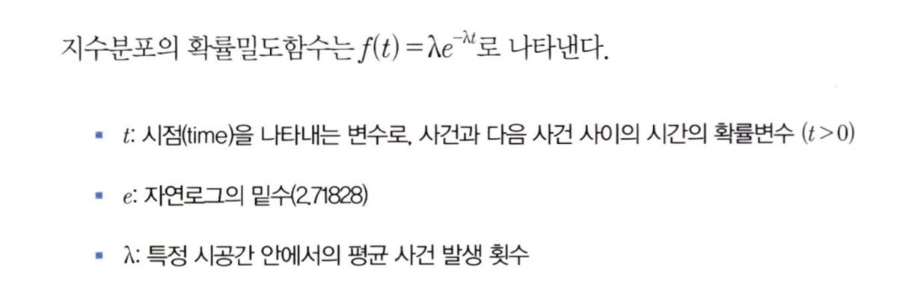
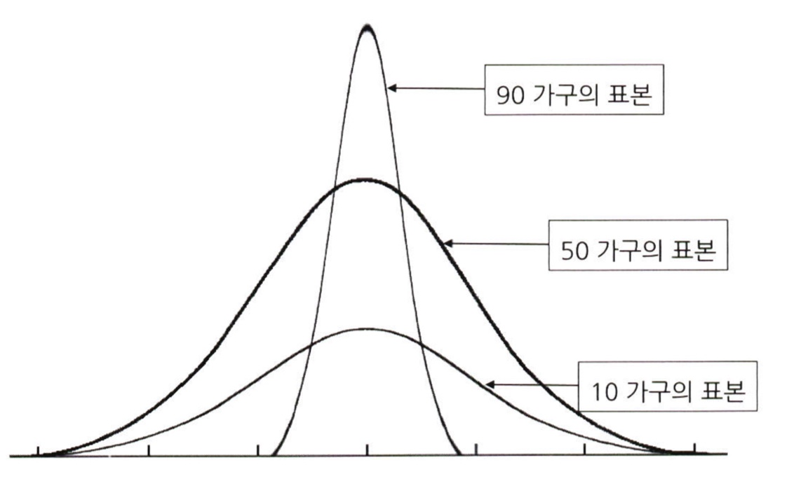
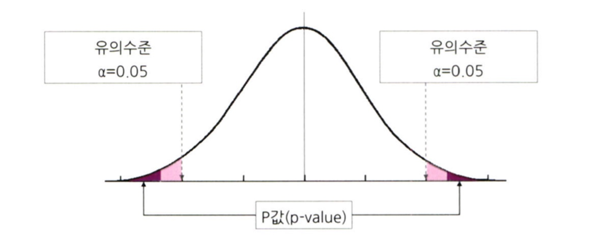
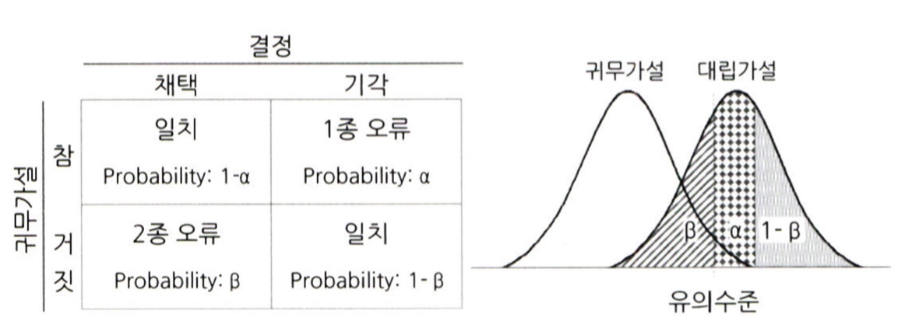

# 통계학 2주차 정규과제

📌통계학 정규과제는 매주 정해진 분량의 『*데이터 분석가가 반드시 알아야 할 모든 것*』 을 읽고 학습하는 것입니다. 이번 주는 아래의 **Statistics_2nd_TIL**에 나열된 분량을 읽고 `학습 목표`에 맞게 공부하시면 됩니다.

아래의 문제를 풀어보며 학습 내용을 점검하세요. 문제를 해결하는 과정에서 개념을 스스로 정리하고, 필요한 경우 추가자료와 교재를 다시 참고하여 보완하는 것이 좋습니다.

2주차는 `1부. 데이터 기초체력 기르기`를 읽고 새롭게 배운 내용을 정리해주시면 됩니다.


## Statistics_2nd_TIL

### 1부. 데이터 기초체력 기르기
### 06. 확률분포
### 07. 가설검정

## Study Schedule

|주차 | 공부 범위     | 완료 여부 |
|----|----------------|----------|
|1주차| 1부 p.2~56     | ✅      |
|2주차| 1부 p.57~79    | ✅      | 
|3주차| 2부 p.82~120   | 🍽️      | 
|4주차| 2부 p.121~202  | 🍽️      | 
|5주차| 2부 p.203~254  | 🍽️      | 
|6주차| 3부 p.300~356  | 🍽️      | 
|7주차| 3부 p.357~615  | 🍽️      |

<!-- 여기까진 그대로 둬 주세요-->

# 06. 확률분포

```
✅ 학습 목표 :
* 이산확률분포의 종류와 특징을 설명할 수 있다.
* 연속확률분포의 종류와 특징을 설명할 수 있다. 
* 중심극한정리(CLT)의 개념을 이해하고 설명 할 수 있다.
```

## 6.2. 이산확률분포


- 확률질량함수(PMF)로 나타내며, 전체 경우 중 특정 값의 사건이 발생할 수 있는 확률의 크기를 의미, 특정 값을 가질 확률을 계산할 수 있다. 

- 균등분포: 결과 x가 동일한 확률을 가지는 분포

- 이항분포:
      
       '동전의 앞뒤', '성공/실패' 같이 1과 0 의 값만을 가짐
       베르누이 시행: 이항분포를 나타낼 수 있는, 결과가  두 가지 중 하나만 나오는 시행

 이항분포의 확률질량함수:
 

 - 초기하분포: 
        
       각 시행이 서로 독립적이지 않아 시행마다 성공할 확률이 다름

       이항분포와 달리 비복원추출

  초기하분포로 100명 중 10명을 뽑을때 2명이 같은 집단에서 나오는 경우
  

  - 포아송분포:

         일정한 관측 공간에서 특정 사건이 발생하는 횟수를 나타내는 이산확률분포

         발생하는 사건은 양의 정수 형태
         모든 사건은 독립적으로 발생
         해당 시공간에서 사건 발생 비율은 항상 같음
         한 번에 둘 이상의 사건이 발생하지 않음 

포아송분포의 확률질량함수


## 6.3. 연속확률분포


- 연속적인 공간 안에 확률변수가 가질 수 있는 값이 무한히 많아서 특정 값을 가질 확률이 0으로 수렴

- 확률변수 X가 특정 구간에 속할 확률

- 확률밀도함수(PDF)를 이용하여 특정 면저에서 사건 발생 확률을 구함

- 정규분포:
       
      가장 대표적인 연속확률분포
      어떤 시행의 횟수를 무한하게 늘리면 정규분포 형태가 됨
      평균을 중심으로 좌우대칭 종 모양
      -> 평균,중앙값, 최빈값이 같음
      그래프의 면적을 계산해 확률을 구함
      계산 시 분편을 줄이기 위해 표준화한 것이 표준정규분포
      -> 평균이 0, 분산이 1인 형태, 확률변수의 편차를 표준편차로 나누어 표준화

- 지수분포:
      
      특정 사건이 발생한 시점으로부터 다음 사건이 발생할 때까지의 시간을 확률변숫값으로 하는 분포
      시간도 특정 구간에 따라 무한한 변숫값 -> 연속확률분포
      확률변수 X의 시간이 증가 -> 사건의 확률이 감소
지수분포의 확률밀도함수
      


## 6.4. 중심극한정리

- 데이터의 크기가 일정한 양(30개)를 넘으면 평균의 분포는 정규분포에 근사한다는 이론

예시) A지역 100가구 에서 100종류의 표본 추출 
     
100개의 표본들 각각의 평균을 분포로 그리면 A지역의 가구 수익 분포와 동일한 모양

10가구 < 50가구 < 90가구 순으로 완만-가파름, 50가구일때 정규분포와 흡사



전수 조사 없이도 표본 퍙균의 분포를 알 수 있어 모집단의 평균의 신뢰 구간을 쉽게 얻을 수 있음음


# 07. 가설검정

```
✅ 학습 목표 :
* 귀무가설과 대립가설의 개념을 정의하고, 주어진 연구 질문에 적절한 가설을 설정할 수 있다.
* 가설검정의 유의수준과 p값의 개념을 설명하고, p값을 해석하여 귀무가설을 기각할지 여부를 판단할 수 있다.
* 1종 오류와 2종 오류의 차이를 설명하고, 실제 사례에서 어떤 오류를 더 중요하게 고려해야 하는지 판별할 수 있다.
```

<!-- 새롭게 배운 내용을 자유롭게 정리해주세요.-->

**귀무가설과 대립가설**

- 귀무가설: Null Hypothesis (H0), 새로이 증명하고자 하는 가설과 반대되는 가설 / 집단 간 차이가 없거나 변수의 영향력이 없는 상태

- 대립가설: Alternative Hypothesis (Ha), 귀무가설과 반대되는, 증명하고자 하는 가설, 귀무가설이 기각됐을때 대안적으로 채택

ex) 귀무가설: 컴퓨터 게임 시간과 성적은 관련이 없다.
   
  대립가설: 컴퓨터 게임 시간이 짧아질수록 성적이 향상될 것이다.

**유의수준과 p값**

 - 가설 검정에서 표본의 검정 통계량이 분포상 어디 속하는지에 귀무가설을 채택 / 기각

 - 다시 말해 귀무가설에 대한 p값이 유의수준 안에 들어오는지에 따라 판별

 - 검정에 의한 p값이 유의수준보다 작으면 귀무가설 기각, 그 이상이면 귀무가설 채택



**1종 오류와 2종 오류**

확률을 통해 가설을 기각하거나 채택해도 오류가 발생할 수 있음음

- 1종 오류: 귀무가설이 참임에도 불구하고 귀무가설을 기각하는 오류 (실제로 효과가 없는데 있다고 판단) 

- 2종 오류: 귀무가설이 거짓임에도 물구하고 귀무가설을 채택하는 오류 (실제로 효과가 있는데 없다고 판단)

- 1종 오류와 2종 오류는 서로 트레이드오프 관계

- 일반적으로 기존의 명제인 귀무가설을 잘못 판단한다는 1종 오류를 더 중요하게 여기지만 상황에 따라 2종 오류가 더 중요해질 수 있음



<br>
<br>

# 확인 문제

## 문제 1.

> **🧚Q. 다음 중 귀무가설(H₀)을 기각해야 하는 경우는 언제인가요? 정답을 고르고, 그 이유를 간단히 설명해주세요.**

> **1️⃣ 유의수준(α)이 0.05이고, p값이 0.03일 때   
2️⃣ 유의수준(α)이 0.01이고, p값이 0.02일 때**

```
**유의수준(α)이 0.05이고, p값이 0.03일 때**

귀무가설을 기각하려면 p값이 유의수준보다 작아야하는데, 

첫 번째 경우, p값이 0.03으로 유의수준 0.05보다 작으므로 귀무가설을 기각할 수 있음음

두 번째 경우, p값이 0.02로 유의수준 0.01보다 크기 때문에 귀무가설을 기각할 수 없음
```

### 🎉 수고하셨습니다.
