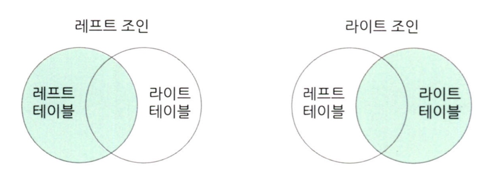
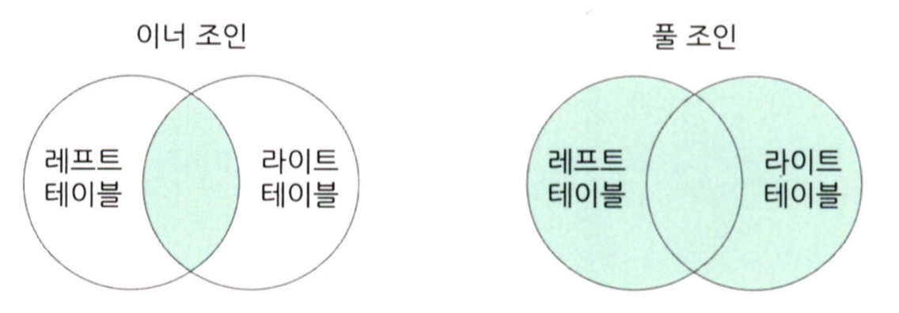

# 통계학 3주차 정규과제

📌통계학 정규과제는 매주 정해진 분량의 『*데이터 분석가가 반드시 알아야 할 모든 것*』 을 읽고 학습하는 것입니다. 이번 주는 아래의 **Statistics_3rd_TIL**에 나열된 분량을 읽고 `학습 목표`에 맞게 공부하시면 됩니다.

아래의 문제를 풀어보며 학습 내용을 점검하세요. 문제를 해결하는 과정에서 개념을 스스로 정리하고, 필요한 경우 추가자료와 교재를 다시 참고하여 보완하는 것이 좋습니다.

2주차는 `2부-데이터 분석 준비하기`를 읽고 새롭게 배운 내용을 정리해주시면 됩니다.


## Statistics_3rd_TIL

### 2부. 데이터 분석 준비하기
### 08. 분석 프로젝트 준비 및 기획
### 09. 분석 환경 세팅하기


## Study Schedule

|주차 | 공부 범위     | 완료 여부 |
|----|----------------|----------|
|1주차| 1부 p.2~56     | ✅      |
|2주차| 1부 p.57~79    | ✅      | 
|3주차| 2부 p.82~120   | ✅      | 
|4주차| 2부 p.121~202  | 🍽️      | 
|5주차| 2부 p.203~254  | 🍽️      | 
|6주차| 3부 p.300~356  | 🍽️      | 
|7주차| 3부 p.357~615  | 🍽️      |  

<!-- 여기까진 그대로 둬 주세요-->

# 08. 분석 프로젝트 준비 및 기획

```
✅ 학습 목표 :
* 데이터 분석 프로세스를 설명할 수 있다.
* 비즈니스 문제를 정의할 때 주의할 점을 설명할 수 있다.
* 외부 데이터를 수집하는 방법에 대해 인식한다.
```
**데이터 분석의 3단계**

- 설계 단계
         
         -과제 정의 및 범위 설정
         -인력 구성 및 PM 확보
         -실무자와 데이터 분석가 간 협의 체계 수립

- 분석 및 모델링 단계
       
         -데이터 분석을 위한 데이터 MART 구축
         -데이터 준비, 가공, 분석 및 모델 도출
         -모델 검증 및 실무, 경영진 합의
        
- 구축 및 활용 단계
  
         -모델 적용 및 시스템 구축
         -성과 평가 및 추가 / 보완 프로젝트 검토


**CRISP-DM 방법론**

- 1단계. 비즈니스 이해
   
          -현재 상황 평가
          -데이터 마이닝 목표 결정
          -프로젝트 계획 수립

- 2단계. 데이터 이해
  
         -데이터 설명
         -데이터 탐색
         -데이터 품질 확인

- 3단계. 데이터 준비
 
         -데이터 선택
         -데이터 정제
         -필수 데이터 구성
         -데이터 통합

- 4단계. 모델링
  
         -모델링 기법 선정
         -테스트 디자인 생성
         -모델 생성
         -모델 평가

- 5단계. 평가
       
       -결과 평가
       -프로세스 검토
       -다음 단계 결정

- 6단계. 배포
    
      -배포 계획
      -모니터링 및 유지 관리 계획
      -최종 보고서 작성
      -프로젝트 검토


**SAS SEMMA 방법론**

Sampling (데이터추출)
Exploration(데이터탐색)
Modification(변수가공)
Modeling(모델구축)
Assessment(모델평가)


**비즈니스 문제 정의**

- 비즈니스 이해 및 문제 정의가 조금이라도 잘못되면 최종 인사이트 도출 및 솔루션 적용 단계에서 제대로 된 효과를 보기 힘들다.

- 비즈니스 문제는 명확하고 직관적으로 한 문장으로 정리할 수 있어야 한다.

- 현상에 대한 설명으로 끝나서는 안 되고, 본질적인 문제점이 함께 전달되어야 한다.

**외부 데이터 수집 방법**

1. 데이터 구매: 전문 기업으로부터 구매하거나 MOU를 통해 공유

2. 오픈 데이터 수집: 공공 오픈 데이터 사이트에서 데이터를 받아 활용
                 
   * 특별한 비용이나 노력은 없지만 활용성이 높은 데이터를 얻기 어려움

3. 크롤링: 웹에 있는 데이터 크롤링 (스크래핑)
   
   * 데이터를 실시간으로 자유롭게 수집할 수 있지만, 프로그래밍이 필요하며 법적인 이슈도 고려해야 함


# 09. 분석 환경 세팅하기

```
✅ 학습 목표 :
* 데이터 분석의 전체적인 프로세스를 설명할 수 있다.
* 테이블 조인의 개념과 종류를 이해하고, 각 조인 방식의 차이를 구분하여 설명할 수 있다.
* ERD의 개념과 역할을 이해하고, 기본 구성 요소와 관계 유형을 설명할 수 있다.
```

**데이터 처리 프로세스**

- OLTP
    
       -실시간으로 데이터를 트랜잭션 단위로 수집, 분류, 저장하는 시스템
       -데이터가 생성되고 저장되는 첫 번째 단계

- DW (Data Warehouse)
 
       -수집된 데이터를 사용자 관점에서 주제별로 통합하여 쉽게 원하는 데이터를 빼낼 수 있도록 저장해 놓은 통합 데이터베이스
       -OLTP를 보호하고 데이터 활용 효율을 높일 수 있음

- DM (Data Mart)
 
      -사용자의 목적에 맞도록 가공된 일부의 데이터가 저장되는 곳
      -부서나 사용자 집단의 필요에 맞게 가공
      -접근성과 데이터 분석의 효율성을 높이고 시스템 부하를 감소시킬 수 있음

- OLAP


**테이블 조인**

- 조인은 2개 이상의 테이블을 공통의 칼럼을 중심으로 결합하는 것

- 레프트 조인과 라이트 조인
   
      -하나의 테이블을 기준으로 다른 테이블에서 겹치는 부분을 결합
      -기준이 되는 테이블의 데이터는 그대로 유지하면서 조인하는 테이블의 데이터만 추가
      -일치하는 키 값이 없는 행은 조인하는 테이블의 값이 결측값으로 나타남
  

- 이너 조인과 풀 조인
  
       -이너 조인은 두 테이블 간에 겹치는 부분의 행만 가져옴
       -풀 조인은 모든 행을 살리는 조인 방법
       -겹치는 부분 없어도 양 테이블의 모든 행이 생성됨
 

- 크로스 조인

       -드물게 사용되지만 주로 머신러닝에 사용되는 데이터셋을 생성
       -값이 없더라도 모든 행이 생기도록 데이터 가공을 할 때 사용


**ERD**

- Entity Relationship Diagram: 각 테이블의 구성 정보와 테이블 간 관계를 도식으로 표현한 그림

- 데이터 환경을 파악하기 위해 사용되며 ERWin이라는 프로그램을 주로 사용

- 테이블은 엔티티라고 불리며 각 테이블의 연결 키를 직관적으로 확인 가능

- 물리: DB를 효율적이고 결점 없이 구현하는 것이 목표

- 논리: 데이터 사용자 입장에서 테이블 간 매핑에 오류가 없으며 정규화가 이루어진 상태

- 기본 키: 테이블에 적재된 각각의 데이터를 유일하게 구분하는 키

- 외래 키: 각 테이블 간에 연결을 만들기 위해서 테이블에서 다른 테이블의 참조되는 기본 키

- 테이블 간 연결은 1:1, N:N 관계, 외래 키가 정의된 테이블은 자식테이블, 참조되는 테이블은 부모테이블이라고 불림


<br>
<br>

# 확인 문제

## 문제 1.

> **🧚 아래의 테이블을 조인한 결과를 출력하였습니다. 어떤 조인 방식을 사용했는지 맞춰보세요.**

> 사용한 테이블은 다음과 같습니다.

|
---|---|

> 보기: INNER, LEFT, RIGHT 조인

<!-- 테이블 조인의 종류를 이해하였는지 확인하기 위한 문제입니다. 각 테이블이 어떤 조인 방식을 이용하였을지 고민해보고 각 테이블 아래에 답을 작성해주세요.-->

### 1-1. 

```
LEFT 조인
```

### 1-2. 

```
INNER 조인
```

### 1-3. 

```
RIGHT 조인
```

### 🎉 수고하셨습니다.
