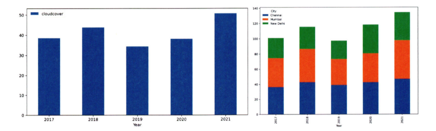

# 통계학 4주차 정규과제

📌통계학 정규과제는 매주 정해진 분량의 『*데이터 분석가가 반드시 알아야 할 모든 것*』 을 읽고 학습하는 것입니다. 이번 주는 아래의 **Statistics_4th_TIL**에 나열된 분량을 읽고 `학습 목표`에 맞게 공부하시면 됩니다.

아래의 문제를 풀어보며 학습 내용을 점검하세요. 문제를 해결하는 과정에서 개념을 스스로 정리하고, 필요한 경우 추가자료와 교재를 다시 참고하여 보완하는 것이 좋습니다.

4주차는 `2부. 데이터 분석 준비하기`를 읽고 새롭게 배운 내용을 정리해주시면 됩니다.


## Statistics_4th_TIL

### 2부. 데이터 분석 준비하기
### 10. 데이터 탐색과 시각화


## Study Schedule

|주차 | 공부 범위     | 완료 여부 |
|----|----------------|----------|
|1주차| 1부 p.2~56     | ✅      |
|2주차| 1부 p.57~79    | ✅      | 
|3주차| 2부 p.82~120   | ✅      | 
|4주차| 2부 p.121~202  | ✅      | 
|5주차| 2부 p.203~254  | 🍽️      | 
|6주차| 3부 p.300~356  | 🍽️      | 
|7주차| 3부 p.357~615  | 🍽️      | 

<!-- 여기까진 그대로 둬 주세요-->

# 10. 데이터 탐색과 시각화

```
✅ 학습 목표 :
* EDA의 목적을 설명할 수 있다.
* 주어진 데이터셋에서 이상치, 누락값, 분포 등을 식별하고 EDA 결과를 바탕으로 데이터셋의 특징을 해석할 수 있다.
* 공분산과 상관계수를 활용하여 두 변수 간의 관계를 해석할 수 있다.
* 적절한 시각화 기법을 선택하여 데이터의 특성을 효과적으로 전달할 수 있다.
```
**EDA**

기술통계와 데이터 시각화를 통해 데이터의 특
성을 파악

극단적인 해석은 피해야 하며 지나친 추론이나 자의적 해석도 지양해야 함

목적

- 데이터의 형태와 척도가 분석에 알맞게 되어있는지 확인(sanity checking)
- 데이터의 평균, 분산, 분포, 패턴 등의 확인을 통해   데이터 특성 파악
- 데이터의 결측값이나 이상치 파악 및 보완
- 변수 간의 관계성 파악
- 분석 목적과 방향성 점검 및 보정

**EDA 실습**
  
 - 데이터 불러오기

  
 - 이상치 및 결측치 식별

  
 - 분포 확인 후 차이점 시각화

 **공분산과 상관성**

 공분산

     - 두 분산의 관계를 뜻하며 두 변수 X1과 X2의 공통적인 분산의 정도를 구함

     - 값이 0이면 두 변수는 상관관계가 없고 양수면 양의 상관관계, 음수면 음의 상관관계

     - 양의 상관관계: X이 커지면 X도 커진다

     -  음의 상관관계: X이 커지면 X는 작아진다

     - 상관관계 없음: X과 X는 선형적인 관계가 없다

 공분산은 각 변수 간의 다른 척도기준이 그대로 반영되어 공분산 값이 지니는 크기가 상관성의 정도를 나타내지 못함

-> 상관계수

    - 피어슨 상관계수를 많이 사용

    - 변수 X1과 X2가 함께 변하는 정도(공분산)를 X1과 X2가 변하는 전체 정도로 나눠준 것 

    - 절댓값이 0.7 이상일 때 상관관계가 매우 높다고 판단하며, 0.4 이상이면 어느 정도 상관관계가 있다고 해석

    - 산점도에서 기울기가 위로 향하면 양의 상관관계를 나타내고 아래로 향하면 음의 상관관계

    -  산점도의 기울기와 상관계수는 관련이 없으며며 분산의 관계성이 같다면 기울기가 크든 작든 상관계수는 같음

    - 상관계수가 높다는 것은 X이 움직일 때 X가 많이 움직인다는 뜻이 아니라 X를 예상할 수 있는 정확도인 설명력이 높다는 것

 

 

 **데이터 시각화**


 누적 막대그래프: 
 한 시점에 2개 이상의 세부 항목이 존재할 때 사용

 
히트맵 차트(Heatmap chart): 그룹과 비교 요소가 많을 때 효과적으로 시각화 가능


 히스토그램: 겹치지 않는 변수의 구간을 동
일하게 나눠 구간별 도수를 막대그래프로 표현

각 구간은 bin이며, 구간의 높이는 밀도, 즉 가로축의 단위 구간에 속한 값의 비율을 나타냄


파이 & 도넛 차트: 질적 척도로 이루어진 변수 중 구성이 단순한 경우 사용


산점도: 두 개의 연속형 변수 간의 관계를 나타내며  점들의 분포와 추세를 통해 두 변수 간의 관계를 파악할 수 있음


박스 플롯: 하나의 그림으로 양적 척도 데이터의 분포 및 편향성, 평균과 중앙값 등 다다양한 수치를 보기 쉽게 정리 가능

<br>
<br>

# 확인 문제

## 문제 1.
> **🧚 공분산과 상관계수의 차이점에 대해 간단히 설명하세요.**

```
공분산은 단순한 원리로 변수 간의 상관관계를 수치화한 것이고 상관성의 정도를 나타내지 못한다. 상관계수는 그 공분산을 두 변수의 표준편차로 나눈 값이며 관계의 강도나 방향을 더 잘 비교할 수 있다.
```

## 문제 2.
> **🧚 다음 데이터 분석 목표에 적합한 시각화 방법을 보기에서 모두 골라 연결해주세요.**

> 보기: 산점도, 선그래프, 막대그래프, 히스토그램, 박스플롯

(a) 변수의 분포 확인   
(b) 두 변수 간의 관계 확인   
(c) 집단별 평균 비교   
(d) 시계열 데이터 분석

<!--중복 가능-->

```
(a) - 히스토그램, 박스플롯
(b) - 산점도도  
(c) - 막대그래프, 박스플롯
(d) - 선그래프
```


### 🎉 수고하셨습니다.
