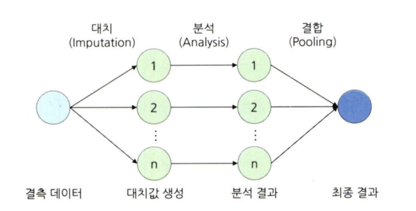

# 통계학 5주차 정규과제

📌통계학 정규과제는 매주 정해진 분량의 『*데이터 분석가가 반드시 알아야 할 모든 것*』 을 읽고 학습하는 것입니다. 이번 주는 아래의 **Statistics_5th_TIL**에 나열된 분량을 읽고 `학습 목표`에 맞게 공부하시면 됩니다.

아래의 문제를 풀어보며 학습 내용을 점검하세요. 문제를 해결하는 과정에서 개념을 스스로 정리하고, 필요한 경우 추가자료와 교재를 다시 참고하여 보완하는 것이 좋습니다.

5주차는 `2부. 데이터 분석 준비하기`를 읽고 새롭게 배운 내용을 정리해주시면 됩니다.


## Statistics_5th_TIL

### 2부. 데이터 분석 준비하기
### 11.데이터 전처리와 파생변수 생성


## Study Schedule

|주차 | 공부 범위     | 완료 여부 |
|----|----------------|----------|
|1주차| 1부 p.2~56     | ✅      |
|2주차| 1부 p.57~79    | ✅      | 
|3주차| 2부 p.82~120   | ✅      | 
|4주차| 2부 p.121~202  | ✅      | 
|5주차| 2부 p.203~254  | ✅      | 
|6주차| 3부 p.300~356  | 🍽️      | 
|7주차| 3부 p.357~615  | 🍽️      | 

<!-- 여기까진 그대로 둬 주세요-->

# 11.데이터 전처리와 파생변수 생성

```
✅ 학습 목표 :
* 결측값과 이상치를 식별하고 적절한 방법으로 처리할 수 있다.
* 데이터 변환과 가공 기법을 학습하고 활용할 수 있다.
* 모델 성능 향상을 위한 파생 변수를 생성하고 활용할 수 있다.
```


## 11.1. 결측값 처리

**결측값**

-  완전 무작위 결측: 순수하게 결측값이 무작위로 발생한 경우

- 무작위 결측: 다른 변수의 특성에 의
해 해당 변수의 결측치가 체계적으로 발생한 경우

-  비무작위 결측: 결측값들이 해당 변수 자체의 특성을 갖고 있는 경우


**결측값 처리 방법**

1. 표본 제거 방법(Completes analysis)
 
   - 결측값이 심하게 많은 변수를 제거하거나 결측값이 포함된 행을 제외하고 분석하는 방법

2. 평균 대치법(Mean Imputation)

   - 결측값을 제외한 온전한 값들의 평균을 구한 다음, 그 평균 값을 결측값들에 대치하는 방법

   - 사용하기 간단하고 결측 표본 제거 방법의 단점을 어느 정도 보완해 줄 수 있다는 장점

   - 관측된 데이터의 평균을 사용하기 때문에 통계량의 표준오차가 왜곡되어 축소되어 나타나고 따라서 p-value가 부정확하게 나타나는 단점

3. 보간법(interpolation)

    - 데이터가 시계열적 특성을 가지고 있을 때 결측값을 전 시점 혹은 다음 시점의 값으로 대치하거나 전 시점과 다음 시점의 평균 값으로 대치하는 방법

  
  
4. 회귀대치법(regression imputation) 

   - 회귀식을 이용하여 결측값을 추정

   - 추정하고자 하는 결측값을 가진 변수를 종속변수로 하고, 나머지 변수를 독립변수로 하여 추정한 회귀식을 통해 결측값을 대치하는 것

   - 인위적으로 회귀식에 확률 오차항을 추가하는 확률적 회귀대치법을 사용하여 변동성을 조정하기도 함

5. 다중 대치법(multiple imputation)

   - 단순 대치법들의 표본오차 과소 추정 문제를 해결하기 위해 최근 많이 사용되는 방법

   - 단순대치를 여러 번 수행하여 개의 가상적 데이터를 생성하여 이들의 평균으로 결측값을 대치

      - 대치 단계: 가능한 대치 값의 분포에서 추출된 서로 다른 값으로 결측치를 처리한 n 개의 데이터셋 생성

      - 분석 단계: 생성된 각각의 데이터셋을 분석하여 모수의 추정치와 표준오차 계산

      - 결합 단계: 계산된 각 데이터셋의 추정치와 표준오차를 결합하여 최종 결측 대치값 산출


  

## 11.2. 이상치 처리

**이상치**

- 일부 관측치의 값이 전체 데이터의 범위에서 크게 벗어난 아주 작거나 큰 극단적인 값을 갖는 것

- 전체 데이터의 양이 많을수록 튀는 값이 통곗값에 미치는 영향력이 줄어들어 이상치 제거의 필요성이 낮아짐

**이상치 처리 방법**

- 가장 간단하게 해당 값을 결측값으로 대체한 다음 결측값 처리를 하거나, 아예 해당 이상치를 제거

- 관측값 변경: 하한 값과 상한 값을 결정한 후 하한 값보다 작으면 하한 값으로 대체하고 상한 값보다 크면 상한 값으로 대체

- 가중치 조정: 이상치의 영향을 감소시키는 가중치를 주는 방법

**이상치 탐색**

-  박스플롯 상에서 분류된 극단치를 그대로 선정하거나 임의로 허용범위를 설정

-  평균은 이상치에 통계량이 민감하게 변하기 때문에 이상치에 보다 강건한 중위수와 중위수 절대 편차
(MAD)를 사용하는 것이 좀 더 효과적


## 11.3. 변수 구간화

**변수 구간화(Binning)**

- 데이터 분석의 성능을 향상시키기 위해서 혹은 해석의 편리성을 위해 이산형 변수를 범주형 변수로 변환하는 것

  
 
이산형 변수를 범주형 변수로 비즈니스적 상황에 맞도
록 변환시킴으로써 데이터의 해석이나 예측, 분류 모델을 의도에 맞도록 유도할 수 있음

p.147


## 11.4. 데이터 표준화와 정규화 스케일링
<!-- 새롭게 배운 내용을 자유롭게 정리해주세요. -->

## 11.5. 모델 성능 향상을 위한 파생 변수 생성
<!-- 새롭게 배운 내용을 자유롭게 정리해주세요. -->


<br>
<br>

# 확인 문제

## 문제 1. 데이터 전처리

> **🧚 한 금융회사의 대출 데이터에서 `소득` 변수에 결측치가 포함되어 있다. 다음 중 가장 적절한 결측치 처리 방법은 무엇인가?**

> **[보기]   
1️⃣ 결측값이 포함된 행을 모두 제거한다.  
2️⃣ 결측값을 `소득` 변수의 평균값으로 대체한다.  
3️⃣ `연령`과 `직업군`을 독립변수로 사용하여 회귀 모델을 만들어 `소득` 값을 예측한다.  
4️⃣ 결측값을 보간법을 이용해 채운다.**

> **[데이터 특징]**     
    - `소득` 변수는 연속형 변수이다.  
    - 소득과 `연령`, `직업군` 간에 강한 상관관계가 있다.  
    - 데이터셋에서 `소득` 변수의 결측 비율은 15%이다.

```
여기에 답을 작성해주세요!
```

## 문제 2. 데이터 스케일링

> **🧚 머신러닝 모델을 학습하는 과정에서, `연봉(단위: 원)`과 `근속연수(단위: 년)`를 동시에 독립변수로 사용해야 합니다. 연봉과 근속연수를 같은 스케일로 맞추기 위해 어떤 스케일링 기법을 적용하는 것이 더 적절한가요?**

<!--표준화와 정규화의 차이점에 대해 고민해보세요.-->

```
여기에 답을 작성해주세요!
```

### 🎉 수고하셨습니다.
