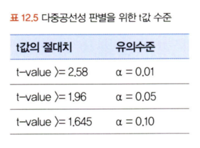
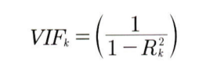

# 통계학 6주차 정규과제

📌통계학 정규과제는 매주 정해진 분량의 『*데이터 분석가가 반드시 알아야 할 모든 것*』 을 읽고 학습하는 것입니다. 이번 주는 아래의 **Statistics_6th_TIL**에 나열된 분량을 읽고 `학습 목표`에 맞게 공부하시면 됩니다.

아래의 문제를 풀어보며 학습 내용을 점검하세요. 문제를 해결하는 과정에서 개념을 스스로 정리하고, 필요한 경우 추가자료와 교재를 다시 참고하여 보완하는 것이 좋습니다.

6주차는 `3부. 데이터 분석하기`를 읽고 새롭게 배운 내용을 정리해주시면 됩니다.


## Statistics_6th_TIL

### 3부. 데이터 분석하기
### 12.통계 기반 분석 방법론


## Study Schedule

|주차 | 공부 범위     | 완료 여부 |
|----|----------------|----------|
|1주차| 1부 p.2~56     | ✅      |
|2주차| 1부 p.57~79    | ✅      | 
|3주차| 2부 p.82~120   | ✅      | 
|4주차| 2부 p.121~202  | ✅      | 
|5주차| 2부 p.203~254  | ✅      | 
|6주차| 3부 p.300~356  | ✅      | 
|7주차| 3부 p.357~615  | 🍽️      |

<!-- 여기까진 그대로 둬 주세요-->

# 12.통계 기반 분석 방법론

```
✅ 학습 목표 :
* 주성분 분석(PCA)의 개념을 설명할 수 있다.
* 다중공선성을 진단할 수 있다.
* Z-TEST와 T-TEST의 개념을 비교하고, 적절한 상황에서 검정을 설계하고 수행할 수 있다.
* ANOVA TEST를 활용하여 세 개 이상의 그룹 간 평균 차이를 검정하고, 사후검정을 수행할 수 있다.
* 카이제곱 검정을 통해 범주형 변수 간의 독립성과 연관성을 분석하는 방법을 설명할 수 있다.
```

## 12.1. 분석 모델 개요

**통계 모델** 

모형과 해석을 중요하게 생각하며, 오차와 불확정성을 강조

**기계 학습**

대용량 데이터를 활용하여 예측의 정확도를 높이는 것이 목표

1. 지도 학습

- 입력에 대한 정답이 주어져서 출력된 결 값과 정답 사이의 오차가 줄어들도록 학습과 모델 수정을 반복

- 결 값이 양적 척도면 회귀를 사용하고, 결 값이 질적 +척도면 분류를 사용

2. 비지도 학습

- 별도의 정답이 없이 변수 간의 패턴을 파악하거나 데이터를 군집화하는 방법

- 차원 축소: 지도학습을 할 때 학습 성능을 높이기 위한 전처리 방법

- 군집분석: 유사한 관측치들끼리 군집으로 분류하여 각 집단의 특성을 분석

3. 강화 학습    

- 동물이 시행착오(trial and error)를 통해 학습하는 과정을 기본 콘셉트로 한 방법

- 원숭이에게 바나나와 전기 충격을 주며 각 버튼의 효과를 알게하는 방식에서 착안

## 12.2. 주성분 분석(PCA)

**주성분 분석(Principal Component Analysis; PCA)**

- 여러 개의 독립변수들을 잘 설명해 줄 수 있는 주된 성분을 추출하는 기법

-  여러 개의 변수들이 소수의 특정한 소수의 변수들로 축약되도록 가공

- 변수의 수를 줄임으로써 모형을 간단하게 만들 수 있고 분석 결과를 보다 효과적으로 해석할 수 있음

- 일반적으로는 제1주성분,제2주성분만으로 대부분의 설명력이 포함되기 때문에 두 개의 주성분만 선정

- 전체 분산 중에서 해당 주성분이 갖고 있는 분산이 곧 설명력

- 이는 모든 포인트들과 주성분과의 거리의 제곱합을 n-1로 나누어서 계산

**차원의 저주**

변수가 늘어남에 따라 차원이 커지면서 분석을 위한 최소한의 필요 데이터 건수가 늘어나면서 예측이 불안정해지는 문제

-> 주성분분석으로 해겷 


## 12.4. 다중공선성 해결과 섀플리 밸류 분석

**다중공선성(multicollinearity)**

- 독립변수들 간의 상관관계가 높은 현상

- 두 개 이상의 독립변수가 서로 선형적인 관계를 나타낼 때, 서로 독립이라는 회귀분석의 전제 가정을 위반

- 회귀분석에서 다중공선성이 발생하게 되면 추정치의 통계적 유의성이 낮아져 모델의 정합성이 맞지 않는 문제가 발생

판별 기준

1. 상관분석을 통해 독립 변수 간의 상관성을 확인하여 높은 상관계수를 갖는 독립변수를 찾아내는 방법

2. 회귀분석 결과에서 독립변수들의 설명력을 의미하는 결정계수 R² 값은 크지만 회귀계수에 대한 값(t-value)이 낮다면 다중공선성을 의심

     

 3. VIF(Variance Inflation Factor), 분산팽창계수

 - 해당 변수가 다른 변수들에 의해 설명될 수 있는 정도를 의미

 - VIF가 큼 -> 해당 변수가 다른 변수들과 상관성이 높음
  -> 회귀 계수에 대한 분산을 증가시키므로 제거 고려

      

 -  R'는 0에서 1 사이에서 정해지기 때문에 VIF 값은 1에서 무한대의 범위를 가짐

 - 5 이상이면 다중공선성을 의심 /  10 이상일 경우 다중공선성이 있다고 판단

해결 방법

• VIF값이 높으면서 종속변수와의 상관성(설명력)이 낮은 변수 제거

• 표본 관측치를 추가적으로 확보

• 로그, 표준화 등을 통한 변수 가공

• 주성분분석을 통한 변수 축약

• 변수 선택 알고리즘을 활용하여 적정 변수 자동 선정


## 12.6. Z-test와 T-test
<!-- 새롭게 배운 내용을 자유롭게 정리해주세요.-->

## 12.7. ANOVA
<!-- 새롭게 배운 내용을 자유롭게 정리해주세요.-->

## 12.8. 카이제곱 검정(교차분석)
<!-- 새롭게 배운 내용을 자유롭게 정리해주세요.-->


<br>
<br>

# 확인 문제

### **문제 1.**
> **🧚 경희는 다트비 교육 연구소의 연구원이다. 경희는 이번에 새롭게 개발한 교육 프로그램이 기존 프로그램보다 학습 성취도 향상에 효과적인지 검증하고자 100명의 학생을 무작위로 두 그룹으로 나누어 한 그룹(A)은 새로운 교육 프로그램을, 다른 그룹(B)은 기존 교육 프로그램을 수강하도록 하였다. 실험을 시작하기 전, 두 그룹(A, B)의 초기 시험 점수 평균을 비교한 결과, 유의미한 차이가 없었다. 8주 후, 학생들의 최종 시험 점수를 수집하여 두 그룹 간 평균 점수를 비교하려고 한다.**   

> **🔍 Q1. 이 실험에서 사용할 적절한 검정 방법은 무엇인가요?**

```
여기에 답을 작성해주세요!
```

> **🔍 Q2. 이 실험에서 설정해야 할 귀무가설과 대립가설을 각각 작성하세요.**

```
여기에 답을 작성해주세요!
```

> **🔍 Q3. 검정을 수행하기 위한 절차를 순서대로 서술하세요.**

<!--P.337의 실습 코드 흐름을 확인하여 데이터를 불러온 후부터 어떤 절차로 검정을 수행해야 하는지 고민해보세요.-->

```
여기에 답을 작성해주세요!
```

> **🔍 Q4. 이 검정을 수행할 때 가정해야 하는 통계적 조건을 설명하세요.**

```
여기에 답을 작성해주세요!
```

> **🔍 Q5. 추가적으로 최신 AI 기반 교육 프로그램(C)도 도입하여 기존 프로그램(B) 및 새로운 프로그램(A)과 비교하여 성취도 차이가 있는지 평가하고자 한다면 어떤 검정 방법을 사용해야 하나요? 단, 실험을 시작하기 전, C 그룹의 초기 점수 평균도 A, B 그룹과 유의미한 차이가 없었다고 가정한다.**

```
여기에 답을 작성해주세요!
```

> **🔍 Q6. 5번에서 답한 검정을 수행한 결과, 유의미한 차이가 나타났다면 추가적으로 어떤 검정을 수행해 볼 수 있을까요?**

```
여기에 답을 작성해주세요!
```

---

### **문제 2. 카이제곱 검정**  
> **🧚 다음 중 어떠한 경우에 카이제곱 검정을 사용해야 하나요?   
1️⃣ 제품 A, B, C의 평균 매출 차이를 비교하고자 한다.  
2️⃣ 남성과 여성의 신체 건강 점수 평균 차이를 분석한다.  
3️⃣ 제품 구매 여부(구매/미구매)와 고객의 연령대(10대, 20대, 30대…) 간의 연관성을 분석한다.  
4️⃣ 특정 치료법이 환자의 혈압을 감소시키는 효과가 있는지 확인한다.**  

```
여기에 답을 작성해주세요!
```

### 🎉 수고하셨습니다.
